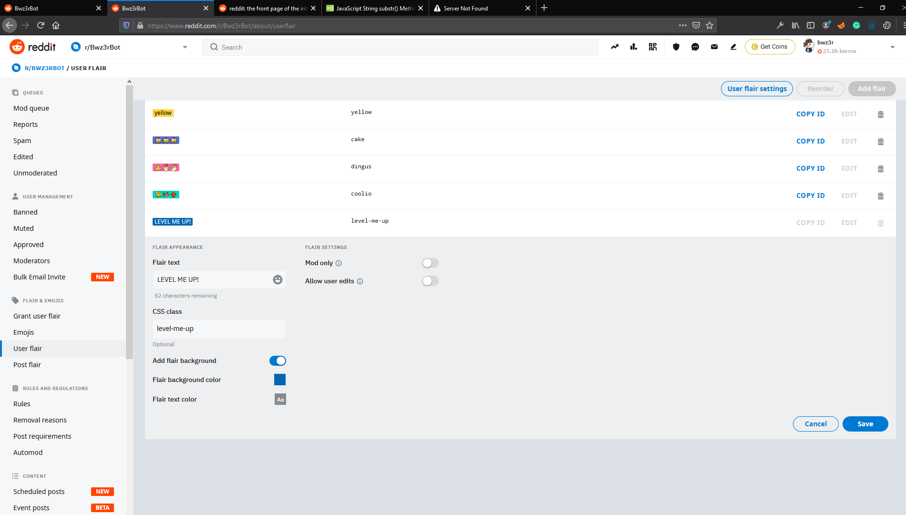

# Post Counter Flair Bot

## Table of Contents

- [About](#about)
- [Getting Started](#getting_started)
    - [Prerequisites](#prereqs)
    - [Installing](#install)


# About <a name = "about"></a>

__Post Counter Flair Bot__ watches your subreddit and allows users to opt-in to a contest. The bot will watch for a specific user flair and will then increment the user's post count within their flair.


# Getting Started <a name = "getting_started"></a>

These instructions will get you a copy of the bot up and running on your local machine.


## Prerequisites <a name="prereqs"></a>

Make sure you have the correct version of NodeJS for your system. You can find the download here(https://nodejs.org/en/download/)

You'll have to create a new account for your bot before you move any further.\
And you'll have to grant the account permissions on your subreddit.\
Once the account is created, log in, go to this url(reddit.com/prefs/apps), and fill out the form to create a new script app.


# Creating flairs <a name="create-flairs"></a>

The bot will need the `Flair` permission to work.

To creare a flair, go into your `Mod Panel` and into the `User Flair` section.

Now create the flair the way you like.

This part is very important!
Make absolutely sure that it has the text: "`LEVEL ME UP!`" and a css class of "`level-me-up`" as well.

The bot will look for a flair text of "`LEVEL ME UP!`" and will then grant the user a flair of "`LEVEL 1`" with the css class as it had previously.



## Installing <a name="install"></a>

Now that you've set up your bot account, granted it permissions on your subreddit, and created a script app, it's time to download the source code and paste in your environment variables.

Download souce code on this page. Open to the pw.envEXAMPLE file.\
Also have open reddit.com/prefs/apps as you'll need to copy/paste the items you'll find there.\
__USER_AGENT__ is just a name that the server will identify your bot by. It can be whatever you want.\
__CLIENT_ID__ and __CLIENT_SECRET__ are fround in prefs/apps.\
__REDDIT_USER__ is your bots username.\
__REDDIT_PASS__ is its password.\
__MASTER_SUB__ is the subreddit it will work on.\
__DEBUG_NETWORK__ can be set to false.\
__STARTUP_LIMIT__ will cause the bot to check this many items when starting up. This is to ensure that when stopping and restarting the bot, no requests are forgotten. Can be set up to 100.\
__SUBMISSION_LIMIT__ is the amount of submissions the bot will check on every sweep after the initial one.\
__INTERVAL__ the time seconds the bot will sleep between requests.


```javascript
USER_AGENT='SnootyScraper'
CLIENT_ID='******'
CLIENT_SECRET='******'
REDDIT_USER='******'
REDDIT_PASS='******'
MASTER_SUB='Bwz3rBot'
DEBUG_NETWORK='false'
STARTUP_LIMIT='10'
SUBMISSION_LIMIT='50'
INTERVAL='250'
```


now remove the EXAMPLE from the end of the filename.

> pw.envEXAMPLE = pw.env

Now go back to your terminal and cd into the folder. Run this command to install the dependencies required to run a reddit bot in JavaScript.

> npm install

Give it a minute to finish installing the dependencies. . . Then:


> node src/app.js